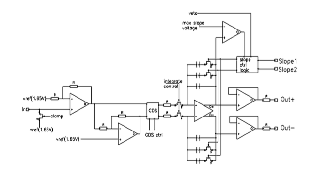

Fast CCD Detector
=================

Introduction
------------

The FastCCD installed in the endstation at CSX-1 is of the LBNL Fast CCD
design. The sensor contains 1920 x 960 pixels of 30 |mu| m x 30 |mu| m
and is arranged into two halves of 960 rows by 960 columns with the columns
parallel to the long CCD axis. There is one output for each 10 columns (a
"super column") which results in 192 individual outputs and analogue to digital
converters (ADC). The CCD camera can either be used in a traditional CCD with
an x-ray shutter exposing the full chip, or in a framestore (frame transfer)
mode by covering two quarters of the CCD with a light (x-ray) block effectively
exposing half the chip along the column direction. 

The analogue CCD signal is digitized by a custom designed fCRIC. Each fCRIC has
16 analogue inputs and digitizes with 13 bit precision and had 16 bit dynamic
range. This is accomplished by having 3 gain ranges of 8x, 4x and 1x with an
auto gain feature. In order to allow negative charge injection. The ADC is
biased at a value of approximately 4096 (0x1000 in hex) with the exact value
dependent on the ADC channel. The gain settings are stored in the two most
significant bits of each ADC reading. The schematic of a single fCRIC chanel is
shown in the :ref:`fig_fcric`.

.. _fig_fcric:

   LBNL fCRIC Circuit Diagram

The specifications of the CCD are summarized below:

*   Pixel Size: 30 |mu| m x 30 |mu| m
*   Active Area: 1920 pixels (column) x 960 pixels (row)
*   192 super columns = 192 outputs (480 rows x 10 columns)
*   Back illuminated
*   250 |mu| m - 350 |mu| m thickness 
*   Full well : ~900k |e| per pixel
*   Sensitivity : 6 |e| / ADU for 8x gain (max gain)
*   Pixel readout time: 500 |mu| s
*   Digitization time: 2 |mu| s at 120 Hz
*   100 Hz maximum data collection

Data Format
-----------

In treating the raw CCD data from the FastCCD there are a few important
considerations related to the multi-gain behaviour of the fCRIC amplifier and
digitizer. The raw 16 bit values that are recorded in the data file follow the
:ref:`data_format` shown below with the two gain bits following the :ref:`gain_setting`. 

.. _data_format:

.. table:: 16 Bit fCRIC Data Format

    +---+---+---+---+---+---+---+---+---+---+---+---+---+---+---+---+
    | 15| 14| 13| 12| 11| 10| 09| 08| 07| 06| 05| 04| 03| 02| 01| 00| 
    +===+===+===+===+===+===+===+===+===+===+===+===+===+===+===+===+
    | G1| G0|ERR|D12|D11|D10|D09|D08|D07|D06|D05|D04|D03|D02|D01|D00|
    +---+---+---+---+---+---+---+---+---+---+---+---+---+---+---+---+

.. _gain_setting:

.. table:: fCRIC Gain Setting

    == == ==== ==========
    G1 G0 Gain Pre-factor
    == == ==== ==========
    0  0  x8   x1
    1  0  x2   x4
    1  1  x1   x8
    == == ==== ==========

Here the two most significant bits record the
gain setting for the encoded value. The least significant 13 bits hold the
measured analogue value. The actual value is therefore related to the measured
value by:

.. math::

    A_{\mathrm{corr}} = G(A_{\mathrm{meas}}-O)

where :math:`A_{\mathrm{corr}}` is the corrected intensity,
:math:`A_{\mathrm{meas}}` is the measured value by the ADC, :math:`G` is the
gain of the ADC and :math:`O` is the bias offset. 

Dark Image Subtraction
----------------------

Due to the multi gain nature of the fCRIC it is therefore necessary to take 3
dark images at different gain settings to obtain the different ADC offsets
under these modes. As the lower gain settings are not subject to
considerable contribution due to dark current it is usually justifiable to
measure only the highest gain dark image repeatedly. Given 3 dark images for
the different gain settings the images the following python pseudo code can be
used to correct for dark current and gain:

.. code:: python
    
    import numpy as np

    def subtract_background(image, dark_image, gains = [1, 4, 8]):
        gain_mask_8 = (image & 0xC000) == 0xC000
        gain_mask_4 = (image & 0xC000) == 0x8000
        gain_mask_1 = (image & 0xC000) == 0x0000

        cor_image = image.astype(np.float16)
        cor_imagei -= gain_mask_8 * dark_image[2]
        cor_imagei -= gain_mask_4 * dark_image[1]
        cor_imagei -= gain_mask_1 * dark_image[0]

        gain_image = (gain_mask_8 * gain[2]) + (gain_mask_4 * gain[1]) + (gain_mask_1 * gain[0])

        return (cor_image * gain_image), gain_image

Useful Links
------------

* `LBNL Fast CCD Site <https://sites.google.com/a/lbl.gov/fast-ccd-camera-systems>`_ 
* `csxtools python analysis routines <https://github.com/NSLS-II-CSX/csxtools>`_
* `libcin low level c driver <https://github.com/NSLS-II-CSX/libcin>`_
* `areaDetector Driver <https://github.com/areaDetector/ADFastCCD>`_

.. |mu| unicode:: 0x00B5
    :rtrim:

.. |e| replace:: e\ :sup:`-`

