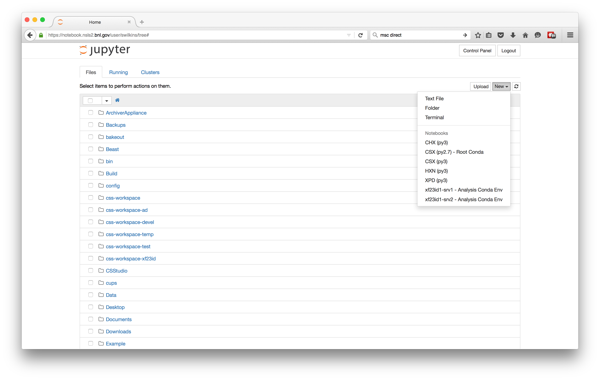
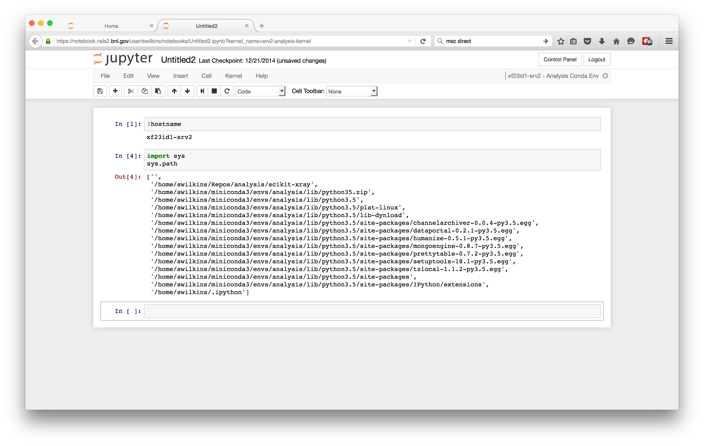

Installing a Personal Conda Environment
=======================================

Introduction
------------

This guide covers installing the conda packaging system *miniconda* into your
own space. This has a number of advantages, including full controll on package
versions. Due to the large nature of the files, it is suggested not to install
into your home directory if you are using NFS home directories. At CSX conda
should be installed on the GPFS file system in the directory
``/GPFS/xf23id/users/<uid>`` where ``<uid>`` is your user ID. 

To create a directory on the **GPFS** system, do the following::

   [swilkins@23id1-srv2 ~]$ sudo mkdir /GPFS/xf23id/users/<uid>
   [swilkins@23id1-srv2 ~]$ sudo chown <uid> /GPFS/xf23id/users/<uid>
   [swilkins@23id1-srv2 ~]$ sudo chmod 750 /GPFS/xf23id/users/<uid>

Where ``<uid>`` is your userid.

Installing Miniconda
--------------------

Install the latest *miniconda*. This can be done by downloading the latest
miniconda binary installer from `conda.pydata.org`_.

Once the file is downloaded make the file executable and run the installer.
**DO NOT** let the installer change your ``.bashrc`` file.::

    [swilkins@xf23id1-srv2 ~/Downloads]$ chmod u+x Miniconda3-latest-Linux-x86_64.sh
    [swilkins@xf23id1-srv2 ~/Downloads]$ ./Miniconda3-latest-Linux-x86_64.sh

When prompted, enter the GPFS path for the install location, for example: ::

    Do you approve the license terms? [yes|no]
    [no] >>> yes
    
    Miniconda3 will now be installed into this location:
    /home/swilkins/miniconda3
    
      - Press ENTER to confirm the location
      - Press CTRL-C to abort the installation
      - Or specify a different location below
    
    [/home/swilkins/miniconda3] >>> /GPFS/xf23id/users/swilkins/miniconda3
    PREFIX=/GPFS/xf23id/users/swilkins/miniconda3
    
To add the *miniconda* to yor path, edit your ``.bashrc`` file with your
favorite editor and add the following lines.

.. code-block:: bash
   
    if [ -e "/GPFS/xf23id/users/swilkins/miniconda3" ]; then
        export PATH="/GPFS/xf23id/users/swilkins/miniconda3/bin:$PATH"
    fi

Substituting ``swilkins`` for your user ID. To enable the path, now source your
``.bashrc`` file::

    [swilkins@xf23id1-srv2 ~/Downloads]$ source ~/.bashrc

Installing a Custom Conda Environment
-------------------------------------

Once miniconda is installed and in the path, configure conda to use the NSLS-II
anaconda cloud server::
    
    [swilkins@xf23id1-srv2 ~/Downloads]$ conda install anaconda-client conda-build --yes
    [swilkins@xf23id1-srv2 ~/Downloads]$ conda config --add channels anaconda
    [swilkins@xf23id1-srv2 ~/Downloads]$ conda config --add channels latest
    [swilkins@xf23id1-srv2 ~/Downloads]$ conda config --add create_default_packages pip
    [swilkins@xf23id1-srv2 ~/Downloads]$ conda config --add create_default_packages anaconda-client
    [swilkins@xf23id1-srv2 ~/Downloads]$ anaconda config --set url https://conda.nsls2.bnl.gov/api
    [swilkins@xf23id1-srv2 ~/Downloads]$ conda config --remove channels defaults --force
    [swilkins@xf23id1-srv2 ~/Downloads]$ conda update --all --yes

Congratulations! You now have a personal installation of *miniconda* connected
to the NSLS-II anaconda cloud server. Now you can create a new environment for
doing your analysis. To create and activate the environment type::

    [swilkins@xf23id1-srv2 ~/Downloads]$ conda create -n analysis python=3.5 
    [swilkins@xf23id1-srv2 ~/Downloads]$ source activate analysis
    (analysis)[swilkins@xf23id1-srv2 ~/Downloads]$ conda install dataportal
    (analysis)[swilkins@xf23id1-srv2 ~/Downloads]$ conda install ipython-notebook

Installing a Custom Notebook Kernel
-----------------------------------

To get your custom environment to work with the notebook server, you have to
create a kernal file in your ``.python/kernel`` directory (where
*my-analysis-kernel* can be any name you wish to know this kernel by)::

    (analysis)[swilkins@xf23id1-srv2 ~]$ cd ~/.ipython/kernels/
    (analysis)[swilkins@xf23id1-srv2 ~/.ipython/kernels]$ mkdir my-analysis-kernel

Now create a *kernel json file* to let the notebook server know how to run this
kernel. Create a file ``kernel.json`` in the directory ``my-analysis-kernel``
with your favorite text editor such as:

.. code-block:: json

    {"argv":["/home/swilkins/miniconda3/envs/analysis/bin/python3.5",
            "-m", "IPython.kernel", "-f", "{connection_file}"],
      "display_name":"xf23id1-srv2 - Analysis Conda Env",
      "host":"xf23id1-srv2"
    }

Where the path ``/home/swilkins/miniconda3/envs/analysis/bin/python3.5`` should
point to the path of python in your home directory conda environment.
``display_name`` should be a nice name for this kernel, and the ``host`` is the
computer on which the kernel should run. 

If all works OK, the new kernel shouls show up in the kernel list on notebook.nsls2.bnl.gov

Running a new notebook from that option will now run a kernel in the new conda environment:

Congratulations!! 

.. _conda.pydata.org: http://conda.pydata.org/miniconda.html
.. _conda_download: https://repo.continuum.io/miniconda/Miniconda3-latest-Linux-x86_64.sh
